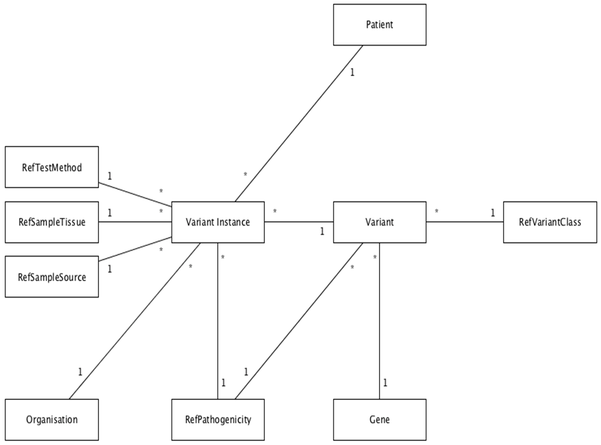

- [Data Access](data-access)
- [Data Dictionary](data-dictionary)

The Australian Node contains information on genetic variants that have been discovered during genetic testing for both diagnostic and research purposes, along with their effects (both known and predicted) on human health.

The data within the Australian Node repositories comes directly from participating laboratories in Australia.

Data upload to the Australian Node repository is initiated by the laboratory staff at their discretion. When initiated, the [HVP Exporter]({{site.baseurl}}system/collection-tools) connects to the labs internal Laboratory Information Management System (LIMS) and extracts a defined set of data elements from new records added to the LIMS since the last upload cycle.

  
Extracted Data Elements

  

    <table class="table table-condensed table-striped">
      <tbody>
        <tr>
          <td>Variant Name</td>
          <td>Gene Name</td>
        </tr>
        <tr>
          <td>Variant Class</td>
          <td>Reference Sequence ID</td>
        </tr>
        <tr>
          <td>Variant Location</td>
          <td>Test method</td>
        </tr>
        <tr>
          <td>Pathogenicity determination</td>
          <td>Sample tissue</td>
        </tr>
        <tr>
          <td>Date of pathogenicity determination</td>
          <td>Sample Source</td>
        </tr>
        <tr>
          <td>Age of patient at time of test</td>
          <td>Whether lab still has sample left</td>
        </tr>
        <tr>
          <td>Justification for pathogenicity determination</td>
          <td>Whether organisation has pedigree data</td>
        </tr>
        <tr>
          <td>PubMed/DOI ids for supporting evidence</td>
          <td>Whether pedigree was considered during diagnosis of pathogenicity</td>
        </tr>
        <tr>
          <td>Whether variant is recorded in disease specific or gene specific database</td>
          <td>Whether histograms are stored</td>
        </tr>
      </tbody>
    </table>
  

The data elements required for a submission to the HVPA Node are based primarily on the minimum reporting requirements specified in the National Pathology Accreditation Advisory Council guidelines *[Requirements for the Medical Testing of Human Nucleic Acids](http://www.health.gov.au/internet/main/publishing.nsf/Content/health-npaac-docs-nad.htm)*.

For each variant to be uploaded to the HVPA Node, a "[Linkage Key](privacy-ethics)" is generated. These linkage keys are coded identifiers that are generated from a subset of personally identifying information that have been non-reversibly encrypted. This process allows data within the HVPA Node to be linked at the patient level to records in other datasets without using personally identifying information and thus protecting the privacy and confidentiality of patients.

##Example Record

  
Variant Instance

  

    <table class="table table-condensed table-striped">
      <tbody>
        <tr>
          <th scope="row">ID</th>
          <td>193</td>
        </tr>
        <tr>
          <th scope="row">HashCode</th>
          <td>YWwQFMTwdL4THvE5s09z8jBEdO5lo7aK==</td>
        </tr>
        <tr>
          <th scope="row">Variant_id</th>
          <td>3</td>
        </tr>
        <tr>
          <th scope="row">InstanceDate</th>
          <td>2013-01-01</td>
        </tr>
        <tr>
          <th scope="row">PatientAge</th>
          <td>NULL</td>
        </tr>
        <tr>
          <th scope="row">TestMethod_id</th>
          <td>NULL</td>
        </tr>
        <tr>
          <th scope="row">SampleTissue_id</th>
          <td>NULL</td>
        </tr>
        <tr>
          <th scope="row">SampleSource_id</th>
          <td>NULL</td>
        </tr>
        <tr>
          <th scope="row">Pathogenicity_id</th>
          <td>Class 1 - Certainly not pathogenic</td>
        </tr>
        <tr>
          <th scope="row">Justification</th>
          <td>NULL</td>
        </tr>
        <tr>
          <th scope="row">PubMed</th>
          <td>NULL</td>
        </tr>
        <tr>
          <th scope="row">RecordedInDatabase</th>
          <td>NULL</td>
        </tr>
        <tr>
          <th scope="row">SampleStored</th>
          <td>NULL</td>
        </tr>
        <tr>
          <th scope="row">PedigreeAvailable</th>
          <td>NULL</td>
        </tr>
        <tr>
          <th scope="row">VariantSegregatesWithDisease</th>
          <td>NULL</td>
        </tr>
        <tr>
          <th scope="row">HistologyStored</th>
          <td>NULL</td>
        </tr>
        <tr>
          <th scope="row">Patient_id</th>
          <td>Lar0uXraIRIHI5RO2lmK==</td>
        </tr>
        <tr>
          <th scope="row">Organisation_id</th>
          <td>46dvEpZCg4BAqJgAqEkH</td>
        </tr>
      </tbody>
    </table>
  

  

    

      
Variant

      

        <table class="table table-condensed table-striped">
          <tbody>
            <tr>
              <th scope="row">ID</th>
              <td>3</td>
            </tr>
            <tr>
              <th scope="row">Gene_id</th>
              <td>1721</td>
            </tr>
            <tr>
              <th scope="row">cDNA</th>
              <td>c.4987-68A&gt;G</td>
            </tr>
            <tr>
              <th scope="row">mRNA</th>
              <td>NULL</td>
            </tr>
            <tr>
              <th scope="row">Genomic</th>
              <td>g.-38473306A&gt;G</td>
            </tr>
            <tr>
              <th scope="row">Protein</th>
              <td>NULL</td>
            </tr>
            <tr>
              <th scope="row">VariantClass_id</th>
              <td>Genomic</td>
            </tr>
            <tr>
              <th scope="row">Location</th>
              <td>NULL</td>
            </tr>
            <tr>
              <th scope="row">Comments</th>
              <td>NULL</td>
            </tr>
            <tr>
              <th scope="row">Pathogenicity_id</th>
              <td>NULL</td>
            </tr>
          </tbody>
        </table>
      

    

    

      
Patient

      

        <table class="table table-condensed table-striped">
          <tbody>
            <tr>
              <th scope="row">HashCode</th>
              <td>Lar0uXraIRIHI5RO2lmK==</td>
            </tr>
            <tr>
              <th scope="row">Ethnicity_id</th>
              <td>Null</td>
            </tr>
          </tbody>
        </table>
      

    

    

      
Organisation

      

        <table class="table table-condensed table-striped">
          <tbody>
            <tr>
              <th scope="row">HashCode</th>
              <td>46dvEpZCg4BAqJgAqEkH</td>
            </tr>
          </tbody>
        </table>
      

    

  

  

    

      
Gene

      

        <table class="table table-condensed table-striped">
          <tbody>
            <tr>
              <th scope="row">ID</th>
              <td>1721</td>
            </tr>
            <tr>
              <th scope="row">GeneName</th>
              <td>BRCA1</td>
            </tr>
            <tr>
              <th scope="row">GeneDescription</th>
              <td>breast cancer 1, early onset</td>
            </tr>
            <tr>
              <th scope="row">RefSeqName</th>
              <td>NM_007294</td>
            </tr>
            <tr>
              <th scope="row">RefSeqVer</th>
              <td>2</td>
            </tr>
            <tr>
              <th scope="row">RefSeqValidStart</th>
              <td>NULL</td>
            </tr>
            <tr>
              <th scope="row">RefSeqValidEnd</th>
              <td>NULL</td>
            </tr>
            <tr>
              <th scope="row">HGNC_ID</th>
              <td>HGNC:1100</td>
            </tr>
            <tr>
              <th scope="row">AlternateSymbols</th>
              <td>RNF53, BRCC1</td>
            </tr>
            <tr>
              <th scope="row">AlternateNames</th>
              <td>BRCA1/BRCA2-containing complex, subunit 1</td>
            </tr>
            <tr>
              <th scope="row">Chromosome</th>
              <td>17q21-q24</td>
            </tr>
            <tr>
              <th scope="row">PreviousSymbols</th>
              <td>&nbsp;</td>
            </tr>
            <tr>
              <th scope="row">PreviousNames</th>
              <td>&nbsp;</td>
            </tr>
            <tr>
              <th scope="row">GenBankName</th>
              <td>NG_005905</td>
            </tr>
            <tr>
              <th scope="row">GenBankVer</th>
              <td>1</td>
            </tr>
          </tbody>
        </table>
      

    

  

##Entity Relationship Diagram

##Data Quality

Maintaining data accuracy (defined as ensuring the data within the repository is described correctly (e.g variants are named according to the Human Genome Variation Society nomenclature system, data is internally consistent, etc.) is achieved via automated means at the time of submission.

Data accuracy checks are incorporated into the HVPA Exporter tool and issues are flagged to users before submission takes place. At the repository side, the HVPA Importer tool maps incoming data elements to common reference sequences to ensure internal consistency of naming.

###Diagnostic Data

For data submitted by diagnostic laboratories (diagnostic data), we assume that the incoming data is of high quality (which we define as data that has been generated in a manner free from errors such as sequencing artefacts, incorrect calling bases and variants, etc.) due to the regulatory requirements that diagnostic laboratories must meet when generating this data. We purposely collect data from diagnostic labs only after they have reported results to the requesting clinician to ensure we capture the data past the point where changes can be made. If a laboratory subsequently finds that they have made an error in their report, a new report will be issued to the clinician and this new information will subsequently be submitted to the Node during the next data upload phase.

###Research Data

Data contributed by laboratories that are not accredited for diagnostic purposes to the Node (research data) undergoes the same accuracy checks as diagnostic data regardless of whether they are submitted through the HVP Exporter or via a bulk, manual upload process. In terms of ensuring data quality, due to the disparate nature of the ways that research data can be generated, assessing data quality in a standardised fashion is difficult.

There are currently no recognised standards for accrediting research data generation practices that can be leveraged to assess the quality of data submitted to the Node. To address this, the Node is working to generate a national data quality standard. Until such time that a standard exists, the Node will continue to clearly differentiate the sources of data contained in the Node to allow users to clearly identify data that has been quality assessed to a recognised standard.
